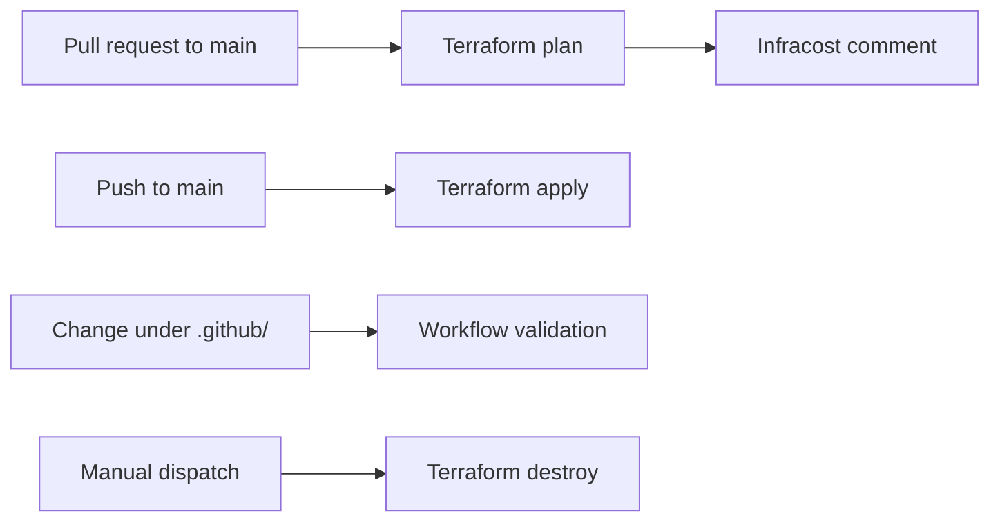

# Terraform AWS Pipeline Template

Golden-pattern GitHub template for Terraform projects that deploy infrastructure to **AWS**. Use this repository when creating a new infrastructure repo so every team starts with the same local tooling, quality gates, CI/CD pipeline, and dependency automation.

The root Terraform module is intentionally minimal — provider constraints, an S3 remote backend block (configured by CI), and a shared `tags` variable. After creating a repository from this template, add your resources and environment-specific values.

## What you get

| Area | What is included |
| --- | --- |
| **Terraform** | 1.11+, AWS provider 6.x, S3 remote backend (populated in CI) |
| **Local tooling** | `Makefile` targets for validate, lint, format, security, and docs |
| **Pre-commit** | Formatting, linting, secret scanning, conventional commits, workflow validation |
| **CI/CD** | Plan on PRs, apply on `main`, manual destroy, workflow validation |
| **Cost visibility** | Infracost on pull requests (via shared workflow) |
| **Dependencies** | [Renovate](https://docs.renovatebot.com/) for updates; Dependabot auto-merge for safe bumps |
| **Documentation** | [terraform-docs](https://terraform-docs.io/) injected into this README |

Reusable workflow logic lives in [appvia-cicd-workflows](https://github.com/appvia/appvia-cicd-workflows). This template wires those workflows with Appvia-standard secrets, permissions, and path filters.

## Repository layout

```
.
├── .github/workflows/
│   ├── terraform.yml       # Plan (PR) and apply (main)
│   ├── destroy.yml           # Manual destroy with confirmation
│   ├── workflows.yml         # Validates workflow YAML on .github/ changes
│   └── dependabot.yml        # Auto-merge policy for Dependabot PRs
├── .cliff/cliff.toml         # git-cliff changelog configuration
├── docs/
│   ├── README.md             # Makefile and layout reference
│   ├── PRECOMMIT.md          # Pre-commit hook details
│   └── WORKFLOWS.md          # GitHub Actions reference
├── values/
│   └── production.tfvars     # Example environment tags
├── terraform.tf              # Versions, backend, provider constraints
├── variables.tf              # Shared inputs (tags)
├── Makefile                  # Local validate / lint / security / docs
├── renovate.json             # Renovate config (GitHub Actions digest pinning)
├── .pre-commit-config.yaml
├── .tflint.hcl
├── .terraform-docs.yml
├── .commitlintrc.yaml
└── .secrets.baseline         # Baseline for detect-secrets
```

Add your infrastructure in new `.tf` files (for example `main.tf`) alongside `terraform.tf` and `variables.tf`. The Makefile also supports optional `examples/*` directories if you add them later.

## Create a repository from this template

### 1. Generate the repo

On GitHub, choose **Use this template** → **Create a new repository**, then clone locally:

```bash
git clone git@github.com:appvia/my-new-terraform-repo.git
cd my-new-terraform-repo
pip install pre-commit
pre-commit install
```

### 2. Customisation checklist

Complete these steps before your first apply:

- [ ] **AWS deployment target** — In [`.github/workflows/terraform.yml`](.github/workflows/terraform.yml), replace `<ACCOUNT_ID>` and `<ROLE_NAME>` in the `with` block.
- [ ] **Destroy workflow** — Apply the same replacements in [`.github/workflows/destroy.yml`](.github/workflows/destroy.yml).
- [ ] **Repository tags** — Update `values/production.tfvars` (and add further `values/*.tfvars` as needed) with your environment, owner, product, and Git repository URL.
- [ ] **CI badge** — Update the workflow badge URL at the top of this README to point at your repository.
- [ ] **Terraform code** — Add a provider configuration and resources (see [Add infrastructure](#add-infrastructure)).
- [ ] **GitHub secrets** — Configure the organisation or repository secrets listed below.
- [ ] **Renovate** — Enable the [Renovate GitHub App](https://github.com/apps/renovate) on the new repository (or inherit from the organisation) so `renovate.json` takes effect.

### 3. Configure GitHub secrets

These secret names are fixed by the shared workflows in `appvia-cicd-workflows`:

| Secret | Purpose |
| --- | --- |
| `ORG_ACTIONS_APP_ID` | GitHub App ID for OIDC authentication in CI |
| `ORG_ACTIONS_APP_SECRET` | GitHub App private key or secret |
| `ORG_INFRACOST_API_KEY` | Infracost API key for cost estimates on pull requests |

### 4. Workflow inputs

**Plan and apply** ([`.github/workflows/terraform.yml`](.github/workflows/terraform.yml)):

```yaml
with:
  aws-account-id: "123456789012"
  aws-role: "MyTerraformDeployRole"
  enable-infracost: true
  enable-private-access: true
  # additional-dir: builds          # optional: copy extra dirs into apply stage
  # additional-dir-optional: true
```

**Destroy** ([`.github/workflows/destroy.yml`](.github/workflows/destroy.yml)) — run manually from the Actions tab. The operator must type the repository name as `confirmation`. Configure the same `aws-account-id` and `aws-role` in the workflow `with` block.

The S3 backend in `terraform.tf` is configured by the pipeline at runtime. For local development, use `terraform init -backend=false` (the Makefile does this automatically).

## Golden-pattern conventions

Teams inheriting this template should follow these defaults unless there is a documented exception:

- **Tagging** — Pass `var.tags` into every taggable resource. Start from the required keys in `values/production.tfvars` (`Environment`, `GitRepo`, `Owner`, `Product`, `Provisioner`).
- **Commits** — Use [Conventional Commits](https://www.conventionalcommits.org/) (`feat:`, `fix:`, `chore:`, etc.). Enforced locally via commitlint and in CI via `make validate`.
- **Formatting** — `terraform fmt` and pre-commit hooks keep style consistent. TFLint rules in `.tflint.hcl` enforce naming, documentation, and module structure.
- **Security** — Trivy scans IaC locally (`make security`) and in pre-commit (tfsec). Secret scanners (detect-secrets, gitleaks) run on every commit.
- **Documentation** — Keep provider, input, and output tables in this README up to date with `make documentation` or the `terraform_docs` pre-commit hook.
- **Workflow pinning** — Reusable workflows are pinned to a commit SHA. Renovate opens PRs to bump those pins; Dependabot auto-merge handles patch (and selected minor) updates.

## Add infrastructure

Create new `.tf` files alongside the scaffold. A typical layout after your first resources:

```
.
├── terraform.tf
├── variables.tf
├── main.tf                 # provider block and resources (add this)
├── values/
│   └── production.tfvars
└── .github/workflows/
    ├── terraform.yml
    ├── destroy.yml
    └── workflows.yml
```

Define the AWS provider and wire tags into resources:

```hcl
provider "aws" {
  # region and other settings for your environment
}

resource "aws_s3_bucket" "example" {
  bucket = "my-org-example-bucket"
  tags   = var.tags
}
```

Environment values example (`values/production.tfvars`):

```hcl
tags = {
  Environment = "Production"
  GitRepo     = "https://github.com/appvia/my-new-terraform-repo"
  Owner       = "Engineering"
  Product     = "LandingZone"
  Provisioner = "Terraform"
}
```

## Local development

Install the tools used by the Makefile and pre-commit hooks:

| Tool | Purpose |
| --- | --- |
| [Terraform](https://developer.hashicorp.com/terraform/install) | Init, validate, fmt |
| [tflint](https://github.com/terraform-linters/tflint) | Terraform linting |
| [trivy](https://aquasecurity.github.io/trivy/) | IaC security scanning |
| [pre-commit](https://pre-commit.com/) | Git hook automation |
| [terraform-docs](https://terraform-docs.io/) | README table generation (optional locally; also runs in pre-commit) |
| [actionlint](https://github.com/rhysd/actionlint) | Workflow linting (`make lint`) |
| [commitlint](https://commitlint.js.org/) | Commit message validation (`make validate`) |

Run the same checks CI expects before opening a pull request:

```bash
make validate    # init, validate, lint, format, security, commitlint, examples
make lint        # tflint + actionlint on workflows
make format      # terraform fmt -recursive
make security    # trivy config (CRITICAL/HIGH)
make clean       # remove .terraform dirs and lock files
make all         # init through documentation generation
```

Pre-commit hooks run automatically on `git commit`. To run them manually:

```bash
pre-commit run --all-files
```

See [docs/PRECOMMIT.md](docs/PRECOMMIT.md) for the full hook list.

## CI/CD behaviour



| Workflow | Trigger | What it does |
| --- | --- | --- |
| [Terraform](.github/workflows/terraform.yml) | Push/PR to `main`, `workflow_dispatch` | Plan on PRs; apply on `main` |
| [Workflow Validation](.github/workflows/workflows.yml) | Changes under `.github/**` | YAML and actionlint checks |
| [Terraform Destroy](.github/workflows/destroy.yml) | Manual only | Destroys managed infrastructure after confirmation |
| [Dependabot Auto-Merge](.github/workflows/dependabot.yml) | Dependabot PR events | Auto-merge patch updates; label major updates |

**Path filters** — Changes under `.github/`, `docs/`, `Makefile`, `README.md`, or `scripts/` do not trigger the Terraform plan/apply workflow, so pipeline metadata can be updated without a full infrastructure run.

Detailed workflow documentation: [docs/WORKFLOWS.md](docs/WORKFLOWS.md).

### Dependency updates

- **Renovate** (`renovate.json`) — Pins GitHub Actions to digests, uses recommended presets, and schedules updates for early Mondays.
- **Dependabot auto-merge** — Patch updates merge automatically; minor updates auto-merge for GitHub Actions and Terraform providers; major updates receive a `major-update` label for manual review.

## Further documentation

- [docs/README.md](docs/README.md) — Makefile targets and repository overview
- [docs/PRECOMMIT.md](docs/PRECOMMIT.md) — Pre-commit installation and hooks
- [docs/WORKFLOWS.md](docs/WORKFLOWS.md) — GitHub Actions reference
- [SECURITY.md](SECURITY.md) — Vulnerability reporting
- [CODE_OF_CONDUCT.md](CODE_OF_CONDUCT.md) — Community standards

## License

This project is licensed under the GNU General Public License v2.0. See [LICENSE](LICENSE).

<!-- BEGIN_TF_DOCS -->
## Providers

No providers.

## Inputs

| Name | Description | Type | Default | Required |
| ---- | ----------- | ---- | ------- | :------: |
| <a name="input_tags"></a> [tags](#input\_tags) | Tags to apply to all resources | `map(string)` | `{}` | no |

## Outputs

No outputs.
<!-- END_TF_DOCS -->
